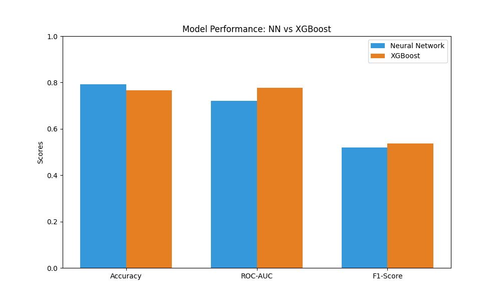
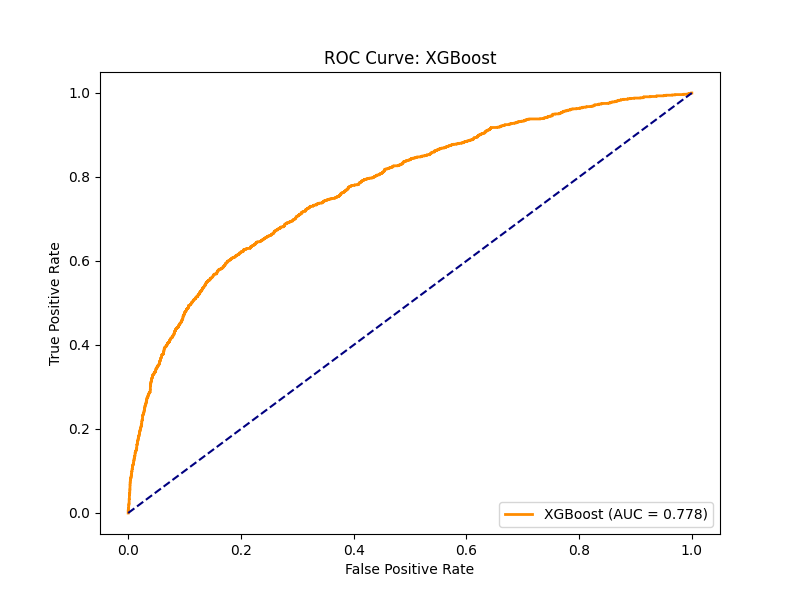
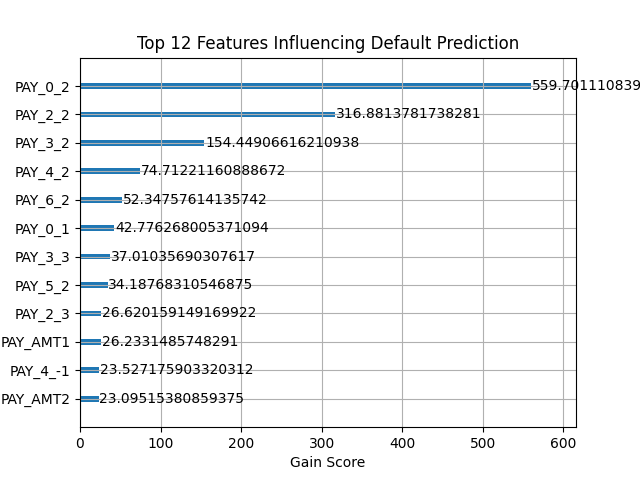

# Credit Risk Intelligence: Neural Networks vs. XGBoost

An end-to-end machine learning pipeline to predict credit card default risk using the UCI Credit Card dataset. This project demonstrates the "Model Pivot"—starting with Deep Learning and optimizing with Gradient Boosting to achieve superior results on tabular data.

## 🚀 Key Achievements
- **Model Comparison:** Benchmarked a PyTorch MLP against an optimized XGBoost model.
- **Improved Performance:** Increased ROC-AUC from **0.72 (NN)** to **0.78 (XGBoost)**.
- **Feature Engineering:** Developed "Utilization" and "Payment" ratios that improved model sensitivity.

## 📊 Results Summary
The core of this project is the performance lift achieved through feature engineering and model selection. While the Neural Network provided a strong baseline, XGBoost captured the tabular relationships more effectively.

| Metric | Neural Network (PyTorch) | XGBoost (Final) | Improvement |
| :--- | :--- | :--- | :--- |
| **ROC-AUC** | 0.720 | **0.781** | **+8.4%** |
| **F1-Score** | 0.520 | **0.550** | **+5.7%** |
| **Accuracy** | 79.2% | **79.5%** | +0.3% |

### 📈 Model Comparison
The bar chart below illustrates the consistent performance lead of the XGBoost model across all classification metrics.



### 🎯 ROC Curve Analysis
The ROC Curve demonstrates the model's ability to distinguish between defaulters and non-defaulters. The XGBoost model shows a significantly higher True Positive Rate.



### 🧬 Feature Importance (Interpretability)
A key advantage of the XGBoost approach was model interpretability. The plot below highlights that my engineered 'Utilization Ratio' and the most recent repayment status (PAY_0) were the strongest predictors of default.



## 🛠️ Feature Engineering
I developed two domain-specific features to capture financial behavior:
1. **Utilization Ratio:** `BILL_AMT / LIMIT_BAL` (Detects over-leveraged clients).
2. **Payment Ratio:** `PAY_AMT / BILL_AMT` (Measures repayment consistency).

## 🧰 Technical Stack
- **Frameworks:** PyTorch, XGBoost, Scikit-Learn
- **Processing:** Pandas, NumPy
- **Visuals:** Seaborn, Matplotlib

## 📂 Repository Structure
- `notebooks/Neural_Net_Credit_Card_Clients_Default_Predictor.ipynb`: Initial PyTorch Multi-Layer Perceptron.
- `notebooks/XGBoost_Credit_Card_Clients_Default_Predictor.ipynb`: Feature engineering and comparison.
- `images/`: PNG files of all performance plots.
- `requirements.txt`: Python environment dependencies.

## 🛠️ Installation
```bash
pip install -r requirements.txt
